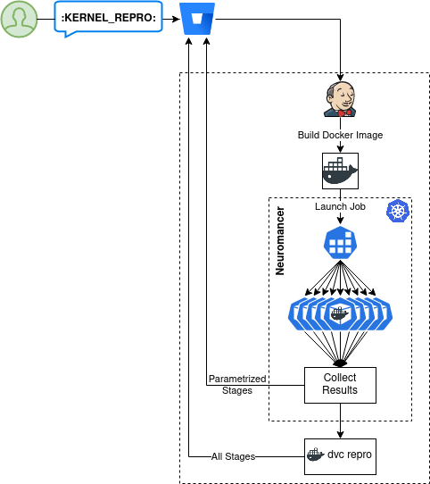

# Distributed, Parallel DVC Pipelines

This project assumes that pipelines follow a map-reduce pattern, where early stages are parametrized over sessions (`foreach: ${sessions}`) and later stages aggregate/summarize the results for each session. This is true of many/most of Kernel's pipelines (e.g. metrics and studies repos). Correct behavior is not guaranteed if the DAG contains multiple merges and splits—e.g. stages A and B are parametrized, and C depends on the results of all `A@*` and `B@*`, and D depends on C AND is also parametrized.

This project is organized in three major components:
* `wintermute`: orchestrates the distributed pipeline by communicating with and managing workers
* `neuromancer`: executes a single work item from the worklist
* Jenkins job logic

## Wintermute
* Prepares a worklist by scanning the repo pipelines for stages parameterized over sessions
* Uses [Terraform Provider Iterative](https://github.com/iterative/terraform-provider-iterative) to launch a parallel k8s job to complete the work
* Shares the repo and worklist with the workers through a shared volume
* Monitors worker execution, failures, and logs
* Gathers results from the workers (through the shared volume, see below) and merges them back into the repo.

## Neuromancer
* Each individual worker spawned by the parallel job calls `neuromancer`.
* This does some basic DVC setup, reads its assigned task from the worklist, then calls `dvc repro` for the applicable stages of a single session.
* Changes to `dvc.lock` files for that session are extracted and placed in the results directory for collection by `wintermute`. Any files not cached by DVC are also collected (e.g. `metrics.json`).

## Jenkins Job
* Before calling `wintermute`, Jenkins builds the Docker image to be used by the workers from the Dockerfile in the DVC project.
* After `wintermute` completes, a new pod is created to run `dvc repro` over the repo with the merged results. This will skip all the stages which were reproduced by `neuromancer` and only reproduce the stages which are not parametrized over sessions (e.g. `summarize` and other top-level evaluation stages).